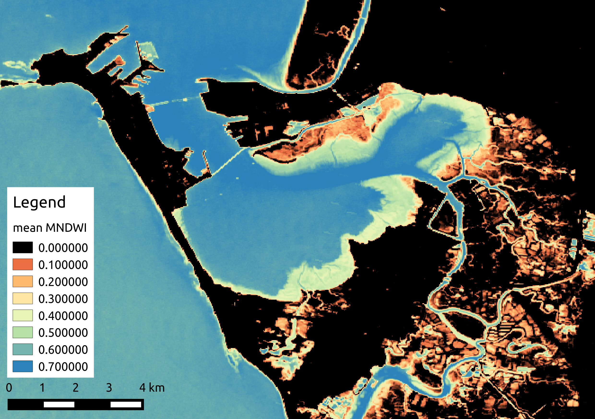
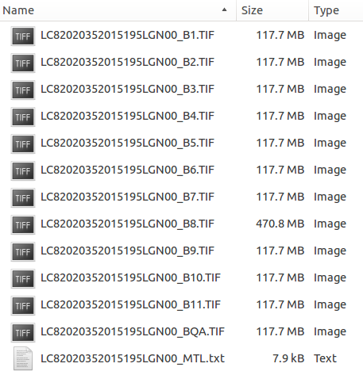
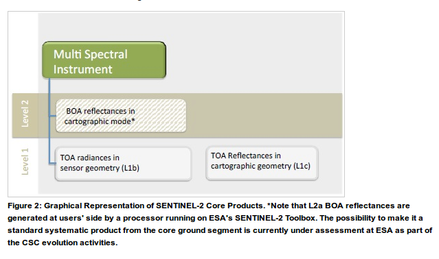
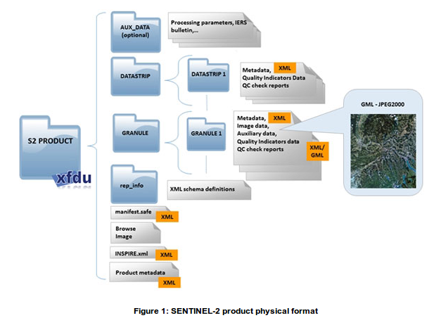
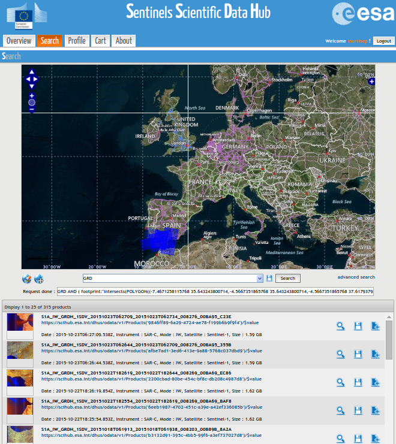

--- .vcenter

> Remote-sensing satellites are impartial and essential recorders of the fast-moving story of the Earth’s changing surface.</p>


José Achache, Director of the GEO Secretariat.


--- .class1 #id1 bg:black;


<iframe src="//commons.wikimedia.org/wiki/File:NASA's_2011_fleet_of_Earth_remote_sensing_observatories.ogv?embedplayer=yes" width="854" height="480" frameborder="0" webkitAllowFullScreen mozallowfullscreen allowFullScreen></iframe>

<div style="position: absolute; left: 200px; top:625px; z-index:10; font-size:14px">
    <p>https://youtu.be/gF9UlTYR5d0</p>
</div>

--- .class1 #id1 bg:black;

<iframe width="560" height="315" src="https://www.youtube-nocookie.com/embed/28hImDyJXu0?controls=0&amp;showinfo=0;&start=36" frameborder="-1" allowfullscreen></iframe>

<div style="position: absolute; left: 200px; top:625px; z-index:10; font-size:14px">
    <p>https://youtu.be/28hImDyJXu0?list=PLbyvawxScNbs9ET50PFwZTworudkNsnH_</p>
</div>

--- .segue #id2 bg:url(assets/img/background_space.png);background-size:cover;
## Remote sensing 101

--- &twocol .class1 #id3 bg:url(assets/img/background_white_astronaut.png);background-size:cover;
## Platform, sensor and resolution

*** =left
### Satellite


*** =right
### Platform
[Landsat 8](http://landsat.usgs.gov/landsat8.php), [Sentinel 1A](https://sentinel.esa.int/web/sentinel/missions/sentinel-1), [Sentinel 2A](https://sentinel.esa.int/web/sentinel/missions/sentinel-2)

### Sensor or Instrument
[OLI](http://landsat.usgs.gov/ldcm_vs_previous.php) + [TIRS](http://landsat.usgs.gov/ldcm_vs_previous.php), [C-SAR](https://sentinel.esa.int/web/sentinel/sentinel-1-sar-wiki/-/wiki/Sentinel%20One/Instrument), [MSI](https://sentinel.esa.int/web/sentinel/technical-guides/sentinel-2-msi/msi-instrument)

### Resolution
+ Spatial: Pixel size, extent
+ Temporal: Revisit time
+ Spectral: Band width, Number of bands, Sensitivity

--- &twocol .class1 #id3 bg:url(assets/img/background_white_astronaut.png);background-size:cover;
## Electromagnetic radiation

*** =left
Has both wave and particle properties at the same time (wave-particle duality).

+ Waves can be described by their <b>amplitude</b> and <b>wavelength</b>
+ <b>Polarisation:</b> waves oscillate in more than one orientation
+ <b>Photons</b> are the elementary particles of eletromagnetic radiation
+ Photons can be interact with matter by <b>scattering</b> and <b>absorption</b>
+ <b>Reflectance</b> is scattering in a defined direction
    
*** =right

<div>
<pw><a href="https://commons.wikimedia.org/wiki/File:Electromagneticwave3D.gif#/media/File:Electromagneticwave3D.gif"></a><br>"<a href="https://commons.wikimedia.org/wiki/File:Electromagneticwave3D.gif#/media/File:Electromagneticwave3D.gif">Electromagneticwave3D</a>" by <a href="//commons.wikimedia.org/wiki/User:Lookang" title="User:Lookang">Lookang</a> many thanks to <a rel="nofollow" class="external text" href="http://www.phy.ntnu.edu.tw/ntnujava/index.php">Fu-Kwun Hwang</a> and <a rel="nofollow" class="external text" href="http://www.compadre.org/osp/items/detail.cfm?ID=7305">author of Easy Java Simulation = Francisco Esquembre</a> - <span class="int-own-work" lang="en">Own work</span>. Licensed under <a title="Creative Commons Attribution-Share Alike 3.0" href="http://creativecommons.org/licenses/by-sa/3.0">CC BY-SA 3.0</a> via <a href="https://commons.wikimedia.org/wiki/">Commons</a>.</pw>
</div> 

--- .class1 #id3 bg:url(assets/img/background_white_astronaut.png);background-size:cover;
## Electromagnetic radiation
<pw><a href="https://commons.wikimedia.org/wiki/File:EM_spectrum.svg#/media/File:EM_spectrum.svg"></a><br>"<a href="https://commons.wikimedia.org/wiki/File:EM_spectrum.svg#/media/File:EM_spectrum.svg">EM spectrum</a>". Licensed under <a href="http://creativecommons.org/licenses/by-sa/3.0/" title="Creative Commons Attribution-Share Alike 3.0">CC BY-SA 3.0</a> via <a href="https://commons.wikimedia.org/wiki/">Commons</a>.</pw>

--- .class1 #id3 bg:url(assets/img/background_white_astronaut.png);background-size:cover;
## Electromagnetic radiation

<pw><a href="https://commons.wikimedia.org/wiki/File:Atmospheric_electromagnetic_opacity.svg#/media/File:Atmospheric_electromagnetic_opacity.svg"></a><br>"<a href="https://commons.wikimedia.org/wiki/File:Atmospheric_electromagnetic_opacity.svg#/media/File:Atmospheric_electromagnetic_opacity.svg">Atmospheric electromagnetic opacity</a>" by NASA (original); SVG by <a href="//en.wikipedia.org/wiki/User:Mysid" class="extiw" title="w:User:Mysid">Mysid</a>. - Vectorized by <a href="//en.wikipedia.org/wiki/User:Mysid" class="extiw" title="w:User:Mysid">User:Mysid</a> in Inkscape, original NASA image from <a href="//commons.wikimedia.org/wiki/File:Atmospheric_electromagnetic_transmittance_or_opacity.jpg" title="File:Atmospheric electromagnetic transmittance or opacity.jpg">File:Atmospheric electromagnetic transmittance or opacity.jpg</a>.. Licensed under Public Domain via <a href="https://commons.wikimedia.org/wiki/">Commons</a>.</pw>

--- &twocol .class1 #id3 bg:url(assets/img/background_white_astronaut.png);background-size:cover;
## Passive visible (+ infrared)

*** =left

<pw>
<a href="/" title="Ocean Optics Web Book"><strong>Ocean Optics Web Book</strong></a> • All contents <a href="http://creativecommons.org/licenses/by/2.0/" title="Creative Commons Attribution license" target="_new"></a> 2015 <a href="http://creativecommons.org/licenses/by/2.0/" title="Creative Commons Attribution license" target="_new">Creative Commons Attribution</a> license.
</pw>

*** =right
### Measures **reflected** sunlight

  + day-time only
  + radiance (light) passes through atmosphere
      + affected by scattering and absorption
      + affected by *clouds*
      + requires *atmospheric correction procedures*

--- &twocol .class1 #id3 bg:url(assets/img/background_white_astronaut.png);background-size:cover;
## Passive visible (+ infrared)

*** =left
Surfaces have specific <b>reflection</b> and <b>absorption</b> properties

  + allows identification using passive remote sensing
  + allows quantification of amount of substances
  
*** =right
<p style= "width: 350px; text-align: right";>
<span style="color:red; font-weight:bold">Red</span> and <span style="color:green; font-weight:bold">green</span> light is absorbed, <span style="color:blue; font-weight:bold">blue</span> reflected.
</p>

<pw><a href="https://commons.wikimedia.org/wiki/File:Simple_reflectance.svg#/media/File:Simple_reflectance.svg"> </a><br>"<a href="https://commons.wikimedia.org/wiki/File:Simple_reflectance.svg#/media/File:Simple_reflectance.svg">Simple reflectance</a>" by <a href="//commons.wikimedia.org/wiki/User:Phidauex" title="User:Phidauex">User:Phidauex</a> - <span class="int-own-work" lang="en">Own work</span>. Licensed under Public Domain via <a href="https://commons.wikimedia.org/wiki/">Commons</a>.</pw>

--- .class1 .vcenter #id3 bg:url(assets/img/background_white_astronaut.png);background-size:cover;
## Passive visible (+ infrared)
<p style= "width: 900px;">
Water strongly absorbs light giving it a distinctive <b>reflectance spectra</b> that can be summarised by spectral indices (ratios), e.g., the 'Normalised Difference Water Index' (NDWI, ADD REFERENCE).
</p>

<div style="position: absolute; left: 210px; top:225px;">
<pw><a href="https://commons.wikimedia.org/wiki/File:Absorption_spectrum_of_liquid_water.png#/media/File:Absorption_spectrum_of_liquid_water.png"></a><br>"<a href="https://commons.wikimedia.org/wiki/File:Absorption_spectrum_of_liquid_water.png#/media/File:Absorption_spectrum_of_liquid_water.png">Absorption spectrum of liquid water</a>" by <a href="//en.wikipedia.org/wiki/User:Kebes" class="extiw" title="wikipedia:User:Kebes">Kebes</a> at <a href="//en.wikipedia.org/wiki/" class="extiw" title="wikipedia:">English Wikipedia</a>. Licensed under <a title="Creative Commons Attribution-Share Alike 3.0" href="http://creativecommons.org/licenses/by-sa/3.0">CC BY-SA 3.0</a> via <a href="https://commons.wikimedia.org/wiki/">Commons</a>.</pw>
</div>

<div style="position: absolute; left: 400px; top:190px; z-index:10; font-size:18px">
    <p><b>NDWI</b> = (<span style="color:#a23c52;font-weight:bold">NIR</span> - <span style="color:green; font-weight:bold">Green</span>)/(<span style="color:#a23c52;font-weight:bold">NIR</span> + <span style="color:green; font-weight:bold">Green</span>)</p>
</div>

--- .class1 .vcenter #id3 bg:url(assets/img/background_white_astronaut.png);background-size:cover;
## Passive visible (+ infrared)
<p style= "width: 900px;">
All photosynthetic organisms contain chlorophyll giving them a distinctive <b>reflectance spectra</b> that can be summarised by spectral indices (ratios), e.g., the 'Normalised Difference Vegetation Index' (NDVI).
</p>

<div style="position: absolute; left: 210px; top:230px;">
<pw><a href="http://wiki.landscapetoolbox.org/lib/exe/detail.php/remote_sensing_methods:veg_spectral_response.jpg?id=remote_sensing_methods%3Anormalized_difference_vegetation_index"> </a>
<br>"<a href="http://wiki.landscapetoolbox.org/lib/exe/detail.php/remote_sensing_methods:veg_spectral_response.jpg?id=remote_sensing_methods%3Anormalized_difference_vegetation_index">Vegetation spectral response</a>" by <a href="http://wiki.landscapetoolbox.org"> wiki.landscapetoolbox.org</a>. Licensed under Public Domain via <a href="https://commons.wikimedia.org/wiki/">Commons</a>.</pw>
</div>

<div style="position: absolute; left: 400px; top:225px; z-index:10; font-size:18px">
    <p><b>NDVI</b> = (<span style="color:#a23c52;font-weight:bold">NIR</span> - <span style="color:red; font-weight:bold">Red</span>)/(<span style="color:#a23c52;font-weight:bold">NIR</span> + <span style="color:red; font-weight:bold">Red</span>)</p>
</div>

--- &twocol .class1 #id3 bg:url(assets/img/background_white_astronaut.png);background-size:cover;
## Passive visible (+ infrared)
<p style= "width: 900px;">
Spectral ratios, such as NDWI and NDVI can be used to <b>quantify properties of foreshores</b>.
</p>

*** =left
<div>
<pw><a href="http://www.springerlink.com/content/y221800764571628"> </a>
<br>"<a href="http://www.springerlink.com/content/y221800764571628">Fig. 6 Relationship between NDVI and chlorophyll...</a>" by <a href="http://www.springerlink.com/content/y221800764571628"> Kromkamp et al. 2006</a>. </pw>
</div>

*** =right
<div>
<pw>
<br>"Time-ensemble (2000-2015) mean modified normalised difference water index (MNDWI) of Cadiz Bay derived from the Landsat (USGS) archive" by <a href="http://www.fast-space-project.eu"> FAST project</a>. </pw>
</div>

--- .class1 #id3 bg:url(assets/img/background_white_astronaut.png);background-size:cover;
## Passive visible (+ infrared)
<p style= "width: 900px;">
The different pigments of photosynthetic organisms result in different 'colours', potentially allowing <b>identification of foreshore vegetation types</b>.
</p>
<div style="position: absolute; left: 50px; top:200px;">
<pw><a href="https://en.wikipedia.org/wiki/Chloroplast#Structure"> </a>
<br><a href="https://en.wikipedia.org/wiki/Chloroplast#Structure">wikipedia.org/wiki/Chloroplast</a>.</pw>
</div>

--- .class1 #id3 bg:url(assets/img/background_white_astronaut.png);background-size:cover;
## Active radio

+ cover speckle

--- .class1 #id3 bg:url(assets/img/background_white_astronaut.png);background-size:cover;
### Applications
Contains information on...

--- .class1 #id3 bg:url(assets/img/background_white_astronaut.png);background-size:cover;
## Further resources

General:

+ [Glossary of remote sensing terms](https://directory.eoportal.org/documents/163813/238965/Glossary.pdf)
+ [EO portal database of satellite missions](https://directory.eoportal.org/web/eoportal/satellite-missions)
+ [Landscape Toolbox Wiki](http://wiki.landscapetoolbox.org)

Passive visible (+ infrared):

+ [Ocean optics web book](http://www.oceanopticsbook.info/)

Active radar (SAR):

+ [Moreira, A., Prats-Iraola, P., Younis, M., Krieger, G., Hajnsek, I., & Papathanassiou, K. P. (2013). A tutorial on synthetic aperture radar. Geoscience and Remote Sensing Magazine, IEEE, 1(1), 6-43.](http://elib.dlr.de/82313/1/SAR-Tutorial-March-2013.pdf)
+ [SAREDU](https://saredu.dlr.de/); full open-access course on SAR by [DLR](http://www.dlr.de)

--- .segue #id4 bg:url(assets/img/background_scientist_marsh.png);background-size:cover;
## How to access remote sensing data

--- .class1 #id5 bg:url(assets/img/background_white_scientist_tablet.png);background-size:cover;
## Data availability

```{r, echo=FALSE,results='asis'}
tb <- read.csv2("assets/data/OA-earth-observation-data.csv")
kable(x=tb, format="html", digits = getOption("digits"), row.names = NA, col.names = c("Name",	"Abbreviation",	"Resolution (m)",	"Availability",	"Return Interval",	"Type*"	,"Platform"), 
    align= NULL, caption = "Some earth observation satellites with open access data, based on <a href=http://wiki.landscapetoolbox.org/doku.php/remote_sensor_types:home>wiki.landscapetoolbox.org</a>. *C=Color, E=Elevation, H=Hyperspectral, M=Multispectral, P=Panchromatic, R=Syntheric Aperature Radar"
    #, format.args = list()
    , escape = TRUE)

```


--- .class1 #id5 bg:url(assets/img/background_white_scientist_tablet.png);background-size:cover;
## Data type and format
### Landsat Missions Timeline

<div>
<pw><a href="http://landsat.usgs.gov//about_mission_history.php"> </a>
<br><a href="http://landsat.usgs.gov//about_mission_history.php">http://landsat.usgs.gov//about_mission_history.php</a>.</pw>
</div>

--- &twocol .class1 #id5 bg:url(assets/img/background_white_scientist_tablet.png);background-size:cover;
## Data type and format
### Landsat product types

*** =right

+ High latitudes (> 65º) may not be valid.

<div>
<pw><a href="http://landsat.usgs.gov//landsat_level_1_standard_data_products.php"> </a>
<br><a href="http://landsat.usgs.gov//landsat_level_1_standard_data_products.php">http://landsat.usgs.gov//landsat_level_1_standard_data_products.php</a>.</pw>
</div>

*** =left

Generally *surface reflectance* products are prefered, however see [L8-SR user notes](http://landsat.usgs.gov/documents/Provisional_Landsat_8_SURFACE_REFLECTANCE_EE.pdf) and [Landsat Higher Level Science Data Products](http://landsat.usgs.gov/CDR_ECV.php):

+ not completely validated
+ not all scenes can be processed: Landsat 8 Pre-WRS-2 scenes (before April 11, 2013), scenes with a solar zenith angle greater than 76°.
+ Efficancy of L8SR correction will be likely reduced in: Hyper arid or snow covered regions, Low sun angle conditions, <b>Coastal regions where land area is small relative to adjacent water</b>, Areas with extensive cloud contamination.

--- .class1 #id5 bg:url(assets/img/background_white_scientist_tablet.png);background-size:cover;
## Data format and type
### Landsat Standard L1 products

+ Standard Terrain Correction (Level 1T -precision and terrain correction) if possible.
+ Cubic Convolution (CC) resampling method.
+ 30-meter (TM, ETM+, OLI) and 60-meter (MSS) pixel size (reflective bands).
+ Universal Transverse Mercator (UTM) map projection (Polar Stereographic projection for scenes with a center latitude greater than or equal to -63.0 degrees).
+ World Geodetic System (WGS) 84 datum.
+ MAP (North-up) image orientation.
+ GeoTIFF per band, quality assement + metadata (`.MTL`)

<div style="position: absolute; left: 700px; top:380px;">
 
</div>

--- .class1 #id5 bg:url(assets/img/background_white_scientist_tablet.png);background-size:cover;
## Data format and type
### Landsat Higher Level Science Data products

+ [surface reflectance](http://landsat.usgs.gov/CDR_LSR.php)
    + includes basic classification (water, cloud) and per pixel quality mask
    + metadata is .xml (schema: [http://espa.cr.usgs.gov/v1.2](http://espa.cr.usgs.gov/schema/espa_internal_metadata_v1_2.xsd))
+ [surface reflectance spectral indices](http://landsat.usgs.gov/documents/si_product_guide.pdf)
+ transport format as standard GeoTIFF or ENVI binary or HDF-EOS2, see [guide](http://landsat.usgs.gov/documents/espa_odi_userguide.pdf) 

<div style="position: absolute; left: 400px; top:400px;">
 
</div>


--- .class1 #id5 bg:url(assets/img/background_white_scientist_tablet.png);background-size:cover;
## Data type and format
### Sentinels Timeline

<div style="position: absolute; left: 10px; top:170px;">
<pw><a href="http://www.unoosa.org/pdf/pres/stsc2015/tech-53E.pdf"> </a>
<br><a href="http://www.unoosa.org/pdf/pres/stsc2015/tech-53E.pdf">ESA, http://www.unoosa.org/pdf/pres/stsc2015/tech-53E.pdf</a>.</pw>
</div>

<div style="position: absolute; left: 500px; top:170px;">
<pw><a href="http://www.unoosa.org/pdf/pres/stsc2015/tech-53E.pdf"> </a>
<br><a href="http://www.unoosa.org/pdf/pres/stsc2015/tech-53E.pdf">ESA, http://www.unoosa.org/pdf/pres/stsc2015/tech-53E.pdf</a>.</pw>
</div>

--- .class1 #id5 bg:url(assets/img/background_white_scientist_tablet.png);background-size:cover;
## Data type and format
### Sentinel 1 product types

<div>
<pw><a href="https://sentinel.esa.int/web/sentinel/missions/sentinel-1/data-products"> </a>
<br><a href="https://sentinel.esa.int/web/sentinel/missions/sentinel-1/data-products">https://sentinel.esa.int/web/sentinel/missions/sentinel-1/data-products</a>.</pw>
</div>

--- &twocol .class1 #id5 bg:url(assets/img/background_white_scientist_tablet.png);background-size:cover;
## Data type and format
### Sentinel 1 product format

*** =right
The SENTINEL-SAFE format wraps a folder containing image data in a binary data format and product metadata in XML.

*** =left
<div>
<pw><a href="https://earth.esa.int/web/sentinel/user-guides/sentinel-1-sar/data-formats/sar-formats"> </a>
<br><a href="https://earth.esa.int/web/sentinel/user-guides/sentinel-1-sar/data-formats/sar-formats">https://earth.esa.int/web/sentinel/user-guides/sentinel-1-sar/data-formats/sar-formats</a>.</pw>
</div>

--- .class1 #id5 bg:url(assets/img/background_white_scientist_tablet.png);background-size:cover;
## Data type and format
### Sentinel 2 product types

<div>
<pw><a href="https://sentinel.esa.int/web/sentinel/missions/sentinel-2/data-products"> </a>
<br><a href="https://sentinel.esa.int/web/sentinel/missions/sentinel-2/data-products">https://sentinel.esa.int/web/sentinel/missions/sentinel-2/data-products</a>.</pw>
</div>

--- &twocol .class1 #id5 bg:url(assets/img/background_white_scientist_tablet.png);background-size:cover;
## Data type and format
### Sentinel 2 product format

*** =right
The SENTINEL-SAFE format wraps a folder containing image data in a binary data format and product metadata in XML.

*** =left
<div>
<pw><a href="https://sentinel.esa.int/web/sentinel/user-guides/sentinel-2-msi/data-formats"> </a>
<br><a href="https://sentinel.esa.int/web/sentinel/user-guides/sentinel-2-msi/data-formats">https://sentinel.esa.int/web/sentinel/user-guides/sentinel-2-msi/data-formats</a>.</pw>
</div>


--- &twocol .class1 #id5 bg:url(assets/img/background_white_scientist_tablet.png);background-size:cover;
## Earth Explorer 

*** =right

+ surface reflectance products generated 'on demand'.

<div>
<pw><a href="http://earthexplorer.usgs.gov/"> </a>
<br><a href="http://earthexplorer.usgs.gov/">http://earthexplorer.usgs.gov/</a>.</pw>
</div>

*** =left

+ official bulk dissemination system for the Landsat (and other) products.
+ requires registration (quick and easy); email address used to send download links! 
+ no restrictions on data use but requested to acknowledge source:
    + USGS Products: 	'Data available from the U.S. Geological Survey.'
    + NASA LP DAAC Products: 	'These data are distributed by the Land Processes Distributed Active Archive Center (LP DAAC), located at USGS/EROS, Sioux Falls, SD. http://lpdaac.usgs.gov'


--- &twocol .class1 #id5 bg:url(assets/img/background_white_scientist_tablet.png);background-size:cover;
## Sentinel Scientific Data Hub 

*** =right
<div>
<pw><a href="https://scihub.esa.int"> </a>
<br><a href="https://scihub.esa.int">https://scihub.esa.int</a>.</pw>
</div>

*** =left

+ official bulk dissemination system for the Sentinels products
+ requires registration (quick and easy)
+ use of data implies acceptance of [Terms and Conditions of the use and distribution of Sentinel data](https://sentinel.esa.int/documents/247904/690755/Sentinel_Data_Terms_and_Conditions)
+ no limitations but must attribute 'Copernicus Sentinel data [Year]' or 'Contains modified Copernicus Sentinel data [Year]'

--- .class1 .smaller #id5 bg:url(assets/img/background_white_scientist_tablet.png);background-size:cover;
## Other examples of how to get the data

via commandline using curl (CHECK ME):

```
# search by product type and region
curl -gu User:Password\
"https://scihub.esa.int/dhus/search?
q=producttype:GRD+AND+swathIdentifier:"IW"\
+AND+footprint:"Intersects(POLYGON+((6.13+53.43,6.13+66.15,30.30+66.12,\
30.30+53.43,6.13+53.43)))"&rows=100000&start=0\"

# download a specific product
S:\>curl -u User:Password -JO "https://scihub.esa.int/dhus/odata/v1/\
Products('b94d872a-ef4f-4117-8a6b-1a90466ae785')/$value"
```

--- .class1 .smaller #id5 bg:url(assets/img/background_white_scientist_tablet.png);background-size:cover;
## Other examples of how to get the data

General:

+ [Google Earth Engine](https://earthengine.google.org) (GEE); Landsat archive, Sentinel-1 (available late 2015?), MODIS, MERRIS, ect. Sentinel-2 (planned).
    + Google Storage also mirrors much of these archives. You can install their “[gsutil](https://cloud.google.com/storage/docs/gsutil_install)” (free) and then list this directory, which is indexed by sensor (for example, L8 is Landsat 8) and path/row: `gsutil ls gs://earthengine-public/landsat/`
    + Note Sentinel-1 has undergone further pre-processing in GEE 

Landsat:

+ [USGS Earth Resources Observation and Science (EROS) Center Science Processing Architecture (ESPA) On Demand Interface](http://espa.cr.usgs.gov/) for higher level products and processing options
+ [Landsat Look](http://landsatlook.usgs.gov/) for quick looks and standard data
+ [GloVis](http://glovis.usgs.gov) an alternative to EarthExplorer
+ [Python Landsat-Download](http://olivierhagolle.github.io/LANDSAT-Download/)
+ [Python Landsat-util](https://github.com/developmentseed/landsat-util)

--- .segue #id6 bg:url(assets/img/background_scientist_screen.png);background-size:cover;background-color:#604c3f;
## How to extract information

--- .class1 #id5 bg:url(assets/img/background_white_scientist_screen.png);background-size:cover;
## Basic concepts

Georectifying

Calibration
  + at-instrument
  + top-of-atmosphere
  + surface
      + optical is removing atmosphere
      + sar is topographic corrections

Morphological operations [filtering, changing resolution]

Course classification [clouds, shadows, water]

--- .class1 #id5 bg:url(assets/img/background_white_scientist_screen.png);background-size:cover;

## Sentinel Application Platform (SNAP) | A common architecture for all Sentinel Toolboxes

+ open-source (Java)
+ sucsessor of the mature BEAM + NEST software
+ Python bindings
+ Sensor specific toolboxes
+ Acknowledgments

--- .class1 #id5 bg:url(assets/img/background_white_scientist_screen.png);background-size:cover;

## Sentinel Application Platform (SNAP) | A common architecture for all Sentinel Toolboxes

+ iframe showing page

--- .class1 #id5 bg:url(assets/img/background_white_scientist_screen.png);background-size:cover
## Getting help 

+ In built help
+ Toolbox tutorials
+ The SNAP forum; a shared user experience
+ SNAP development; how to contribute

--- .class1 #id5 bg:url(assets/img/background_white_scientist_screen.png);background-size:cover;
## The power of the Graph Builder and Graph Processing Tool
+ building workflows [graphs]
+ applying to single image
+ batch processing
+ running from the commandline
+ ??access via Python??

--- .segue #id5 bg:url(assets/img/background_endusers.png);background-size:cover;background-color:#97bf0d;
## Now your turn...

--- .class1 #id5 bg:url(assets/img/background_white_endusers.png);background-size:cover;
## Using Sentinel 1 toolbox (S1TBX) to get information about coastal systems [45 min]

+ stick to original zip product
+ further processing using dimap
+ 1 image (Westerschelde)

L1:
+ open image
+ masking
+ calibration
+ speckle filter
+ elipsoid correction
+ convert to decibels
+ look at a profile
+ export data

L2:
+ use graph to do 3 different types of speckle filter
+ open up XML

L3:
+ threshold or classify
