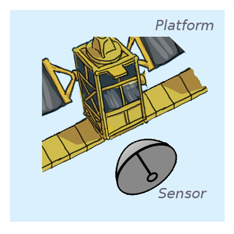
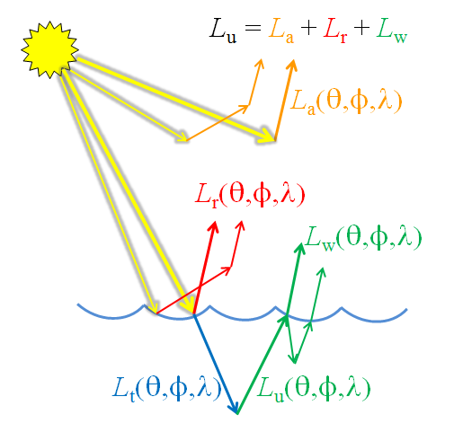
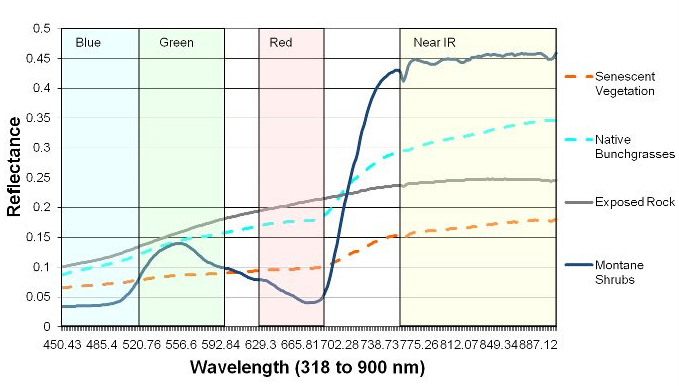
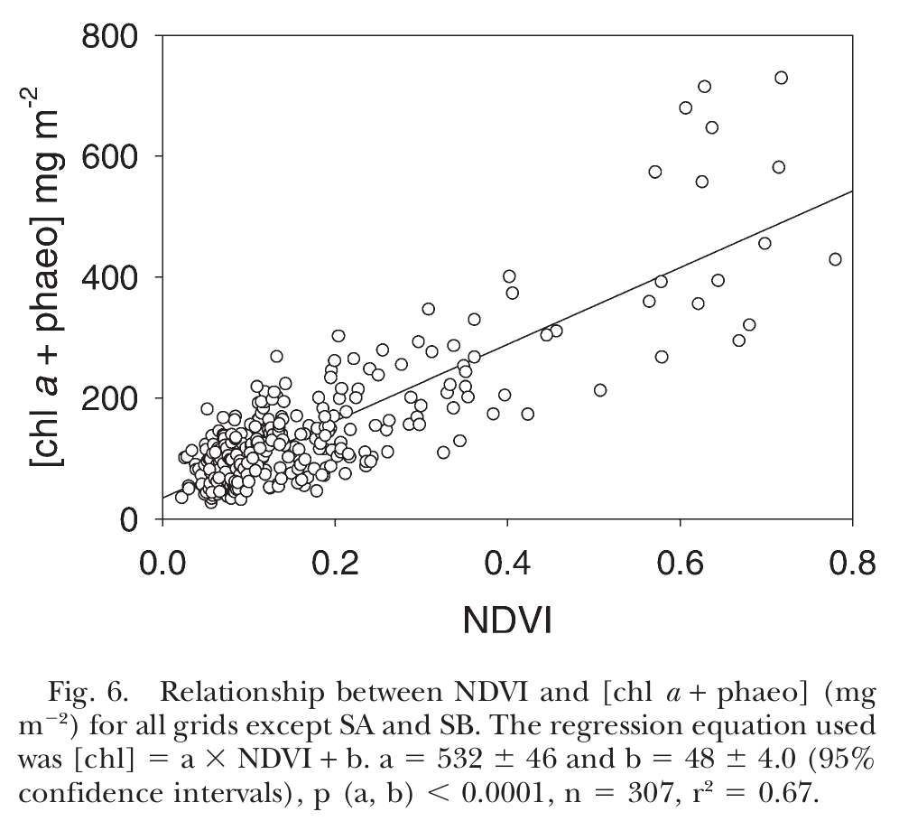

--- .vcenter

> Remote-sensing satellites are impartial and essential recorders of the fast-moving story of the Earth’s changing surface.

José Achache, Director of the GEO Secretariat.

--- .class1 #id1 bg:black;

<iframe width="565" height="315" src="https://www.youtube-nocookie.com/embed/gF9UlTYR5d0?rel=0&amp;controls=0&amp;showinfo=0;&autoplay=1" frameborder="-1" allowfullscreen></iframe>

    
https://youtu.be/gF9UlTYR5d0

--- .class1 #id1 bg:black;

<iframe width="560" height="315" src="https://www.youtube-nocookie.com/embed/28hImDyJXu0?controls=0&amp;showinfo=0;&start=36" frameborder="-1" allowfullscreen></iframe>

    
https://youtu.be/28hImDyJXu0?list=PLbyvawxScNbs9ET50PFwZTworudkNsnH_

--- .segue #id2 bg:url(assets/img/background_space.png);background-size:cover;
## Remote sensing 101

--- &twocol .class1 #id3 bg:url(assets/img/background_white_astronaut.png);background-size:cover;
## Platform, sensor and resolution

*** =left
### Satellite

*** =right
### Platform
[Landsat 8](http://landsat.usgs.gov/landsat8.php), [Sentinel 1A](https://sentinel.esa.int/web/sentinel/missions/sentinel-1), [Sentinel 2A](https://sentinel.esa.int/web/sentinel/missions/sentinel-2)

### Sensor or Instrument
[OLI](http://landsat.usgs.gov/ldcm_vs_previous.php) + [TIRS](http://landsat.usgs.gov/ldcm_vs_previous.php), [C-SAR](https://sentinel.esa.int/web/sentinel/sentinel-1-sar-wiki/-/wiki/Sentinel%20One/Instrument), [MSI](https://sentinel.esa.int/web/sentinel/technical-guides/sentinel-2-msi/msi-instrument)

### Resolution
+ Spatial: Pixel size, extent
+ Temporal: Revisit time
+ Spectral: Band width, Number of bands, Sensitivity

--- .class1 #id3 bg:url(assets/img/background_white_astronaut.png);background-size:cover;
## Electromagnetic radiation

<pw> "<a href="https://commons.wikimedia.org/wiki/File:EM_spectrum.svg#/media/File:EM_spectrum.svg">EM spectrum</a>". Licensed under <a href="http://creativecommons.org/licenses/by-sa/3.0/" title="Creative Commons Attribution-Share Alike 3.0">CC BY-SA 3.0</a> via <a href="https://commons.wikimedia.org/wiki/">Commons</a>.</pw>

--- &twocol .class1 #id3 bg:url(assets/img/background_white_astronaut.png);background-size:cover;
## Electromagnetic radiation

*** =left

Has both wave and particle properties at the same time

+ <b>Polarisation</b>
    + waves oscillate in more than one orientation
    
*** =right

<pw> "<a href="https://commons.wikimedia.org/wiki/File:Electromagneticwave3D.gif#/media/File:Electromagneticwave3D.gif">Electromagneticwave3D</a>" by <a href="//commons.wikimedia.org/wiki/User:Lookang" title="User:Lookang">Lookang</a> many thanks to <a rel="nofollow" class="external text" href="http://www.phy.ntnu.edu.tw/ntnujava/index.php">Fu-Kwun Hwang</a> and <a rel="nofollow" class="external text" href="http://www.compadre.org/osp/items/detail.cfm?ID=7305">author of Easy Java Simulation = Francisco Esquembre</a> - Own work. Licensed under <a title="Creative Commons Attribution-Share Alike 3.0" href="http://creativecommons.org/licenses/by-sa/3.0">CC BY-SA 3.0</a> via <a href="https://commons.wikimedia.org/wiki/">Commons</a>.</pw>
 

--- .class1 #id3 bg:url(assets/img/background_white_astronaut.png);background-size:cover;
## Electromagnetic radiation

<pw> "<a href="https://commons.wikimedia.org/wiki/File:Atmospheric_electromagnetic_opacity.svg#/media/File:Atmospheric_electromagnetic_opacity.svg">Atmospheric electromagnetic opacity</a>" by NASA (original); SVG by <a href="//en.wikipedia.org/wiki/User:Mysid" class="extiw" title="w:User:Mysid">Mysid</a>. - Vectorized by <a href="//en.wikipedia.org/wiki/User:Mysid" class="extiw" title="w:User:Mysid">User:Mysid</a> in Inkscape, original NASA image from <a href="//commons.wikimedia.org/wiki/File:Atmospheric_electromagnetic_transmittance_or_opacity.jpg" title="File:Atmospheric electromagnetic transmittance or opacity.jpg">File:Atmospheric electromagnetic transmittance or opacity.jpg</a>.. Licensed under Public Domain via <a href="https://commons.wikimedia.org/wiki/">Commons</a>.</pw>

--- &twocol .class1 #id3 bg:url(assets/img/background_white_astronaut.png);background-size:cover;
## Passive visible (+ infrared)

*** =left

<pw>
<a href="/" title="Ocean Optics Web Book"><strong>Ocean Optics Web Book</strong></a> • All contents  2015 <a href="http://creativecommons.org/licenses/by/2.0/" title="Creative Commons Attribution license" target="_new">Creative Commons Attribution</a> license.
</pw>

*** =right
### Measures **reflected** sunlight

  + day-time only
  + radiance (light) passes through atmosphere
      + affected by scattering and absorption
      + affected by *clouds*
      + requires *atmospheric correction procedures*

--- &twocol .class1 #id3 bg:url(assets/img/background_white_astronaut.png);background-size:cover;
## Passive visible (+ infrared)

*** =left
Surfaces have specific <b>reflection</b> and <b>absorption</b> properties

  + allows identification using passive remote sensing
  + allows quantification of amount of substances
  
*** =right

Red and green light is absorbed, blue reflected.

<pw> "<a href="https://commons.wikimedia.org/wiki/File:Simple_reflectance.svg#/media/File:Simple_reflectance.svg">Simple reflectance</a>" by <a href="//commons.wikimedia.org/wiki/User:Phidauex" title="User:Phidauex">User:Phidauex</a> - Own work. Licensed under Public Domain via <a href="https://commons.wikimedia.org/wiki/">Commons</a>.</pw>

--- .class1 .vcenter #id3 bg:url(assets/img/background_white_astronaut.png);background-size:cover;
## Passive visible (+ infrared)

All photosynthetic organisms contain chlorophyll giving them a distinctive <b>reflectance spectra</b> that can be summarised by spectral indices (ratios), e.g., the 'Normalised Difference Vegetation Index' (NDVI).

<pw>
 "<a href="http://wiki.landscapetoolbox.org/lib/exe/detail.php/remote_sensing_methods:veg_spectral_response.jpg?id=remote_sensing_methods%3Anormalized_difference_vegetation_index">Vegetation spectral response</a>" by <a href="http://wiki.landscapetoolbox.org"> wiki.landscapetoolbox.org</a>. Licensed under Public Domain via <a href="https://commons.wikimedia.org/wiki/">Commons</a>.</pw>

    
<b>NDVI</b> = (NIR - Red)/(NIR + Red)

--- .class1 .vcenter #id3 bg:url(assets/img/background_white_astronaut.png);background-size:cover;
## Passive visible (+ infrared)

Spectral ratios, such as NDVI can be used to <b>quantify properties of foreshores</b>.

<pw>
 "<a href="http://www.springerlink.com/content/y221800764571628">Fig. 6 Relationship between NDVI and chlorophyll...</a>" by <a href="http://www.springerlink.com/content/y221800764571628"> Kromkamp et al. 2006</a>. Licensed under Open Access by <a href="www.springer.com">Springer</a>.</pw>

--- .class1 #id3 bg:url(assets/img/background_white_astronaut.png);background-size:cover;
## Passive visible (+ infrared)

The different pigments of photosynthetic organisms result in different 'colours', potentially allowing identification of foreshore vegetation types.

<iframe src="https://en.wikipedia.org/wiki/Chloroplast#Structure" id="my-iframe" scrolling="no"></iframe>

    <pw><a href=https://en.wikipedia.org/wiki/Chloroplast#Structure> wikipedia.org/wiki/Chloroplast</a></pw>

--- .class1 #id3 bg:url(assets/img/background_white_astronaut.png);background-size:cover;
## Active radio

+ cover speckle

--- .class1 #id3 bg:url(assets/img/background_white_astronaut.png);background-size:cover;
### Applications
Contains information on...

--- .class1 #id3 bg:url(assets/img/background_white_astronaut.png);background-size:cover;
## Further resources

General:

+ [Glossary of remote sensing terms](https://directory.eoportal.org/documents/163813/238965/Glossary.pdf)
+ [EO portal database of satellite missions](https://directory.eoportal.org/web/eoportal/satellite-missions)
+ [Landscape Toolbox Wiki](http://wiki.landscapetoolbox.org)

Passive visible (+ infrared):

+ [Ocean optics web book](http://www.oceanopticsbook.info/)

Active radar (SAR):

+ [Moreira, A., Prats-Iraola, P., Younis, M., Krieger, G., Hajnsek, I., & Papathanassiou, K. P. (2013). A tutorial on synthetic aperture radar. Geoscience and Remote Sensing Magazine, IEEE, 1(1), 6-43.](http://elib.dlr.de/82313/1/SAR-Tutorial-March-2013.pdf)
+ [SAREDU](https://saredu.dlr.de/); full open-access course on SAR by [DLR](http://www.dlr.de)

--- .segue #id4 bg:url(assets/img/background_scientist_marsh.png);background-size:cover;
## How to access remote sensing data

--- .class1 #id5 bg:url(assets/img/background_white_scientist_tablet.png);background-size:cover;
## Data availability
+ a table giving overview of some platform sensors, type of information and availability

--- .class1 #id5 bg:url(assets/img/background_white_scientist_tablet.png);background-size:cover;
## Data format and type
+ a table giving overview of formats available and product types (landsat, sentinel 1 and 2)

--- .class1 #id5 bg:url(assets/img/background_white_scientist_tablet.png);background-size:cover;
## NASA EarthExplorer
+ screenshots, iframe

--- .class1 #id5 bg:url(assets/img/background_white_scientist_tablet.png);background-size:cover;
## Copernicus SentinelHub

--- .class1 #id5 bg:url(assets/img/background_white_scientist_tablet.png);background-size:cover;
## Other examples of how to get the data

--- .class1 #id5 bg:url(assets/img/background_white_scientist_tablet.png);background-size:cover;

curl -gu User:Password \"https://scihub.esa.int/dhus/search?q=producttype:GRD+AND+swathIdentifier:\"IW\"+AND+footprint:\"Intersects(POLYGON+((6.13+53.43,6.13+66.15,30.30+66.12,30.30+53.43,6.13+53.43)))\"&rows=100000&start=0\"
S:\>curl -u User:Password -JO "https://scihub.esa.int/dhus/odata/v1/Products('b94d872a-ef4f-4117-8a6b-1a90466ae785')/$value"

--- .segue #id6 bg:url(assets/img/background_scientist_screen.png);background-size:cover;background-color:#604c3f;
## How to extract information

--- .class1 #id5 bg:url(assets/img/background_white_scientist_screen.png);background-size:cover;
## Basic concepts

## Georectifying

## Calibration
    + at-instrument
    + top-of-atmosphere
    + surface
        + optical is removing atmosphere
        + sar is topographic corrections

## Morphological operations [filtering, changing resolution]

## Course classification [clouds, shadows, water]

--- .class1 #id5 bg:url(assets/img/background_white_scientist_screen.png);background-size:cover;

## Sentinel Application Platform (SNAP) | A common architecture for all Sentinel Toolboxes

+ open-source (Java)
+ sucsessor of the mature BEAM + NEST software
+ Python bindings
+ Sensor specific toolboxes
+ Acknowledgments

--- .class1 #id5 bg:url(assets/img/background_white_scientist_screen.png);background-size:cover;

## Sentinel Application Platform (SNAP) | A common architecture for all Sentinel Toolboxes

+ iframe showing page

--- .class1 #id5 bg:url(assets/img/background_white_scientist_screen.png);background-size:cover
## Getting help 

+ In built help
+ Toolbox tutorials
+ The SNAP forum; a shared user experience
+ SNAP development; how to contribute

--- .class1 #id5 bg:url(assets/img/background_white_scientist_screen.png);background-size:cover;
## The power of the Graph Builder and Graph Processing Tool
+ building workflows [graphs]
+ applying to single image
+ batch processing
+ running from the commandline
+ ??access via Python??

--- .segue #id5 bg:url(assets/img/background_endusers.png);background-size:cover;background-color:#97bf0d;
## Now your turn...

--- .class1 #id5 bg:url(assets/img/background_white_endusers.png);background-size:cover;
## Using Sentinel 1 toolbox (S1TBX) to get information about coastal systems [15 min, examples to be defined!]

+ stick to original zip product
+ further processing using dimap
+ 1 image (chosen region depends on if we use S2, or Westerschelde)

L1:
+ open image
+ masking
+ calibration
+ speckle filter
+ elipsoid correction
+ convert to decibels
+ look at a profile
+ export data

L2:
+ use graph to do 3 different types of speckle filter
+ open up XML

L3:
+ threshold or classify

--- .class1 #id5 bg:url(assets/img/background_white_endusers.png);background-size:cover;
## Using Sentinel 2 toolbox (S2TBX) to get information about coastal systems [15 min, examples to be defined!]

+ check if image in italy is useful, check possibility of using landsat

L1:
+ open image
+ masking/clipping
+ calibration - at-sensor, TOA, and surface??
+ look at a profile and spectra 
+ export data

L2:
+ calculate band ratios using calculator (NDVI, MNDWI)

L3:
+ threshold, pca, classify

--- .class1 #id5 bg:url(assets/img/background_white_endusers.png);background-size:cover;
## Together is better! Synergy products [15 min, examples to be defined!]

L1:
+ open 2 images (provide images as backup)
+ resample S1 to 10 m
+ combine virtual raster
+ look at a profile
+ export data

L3:
+ pca, classify
